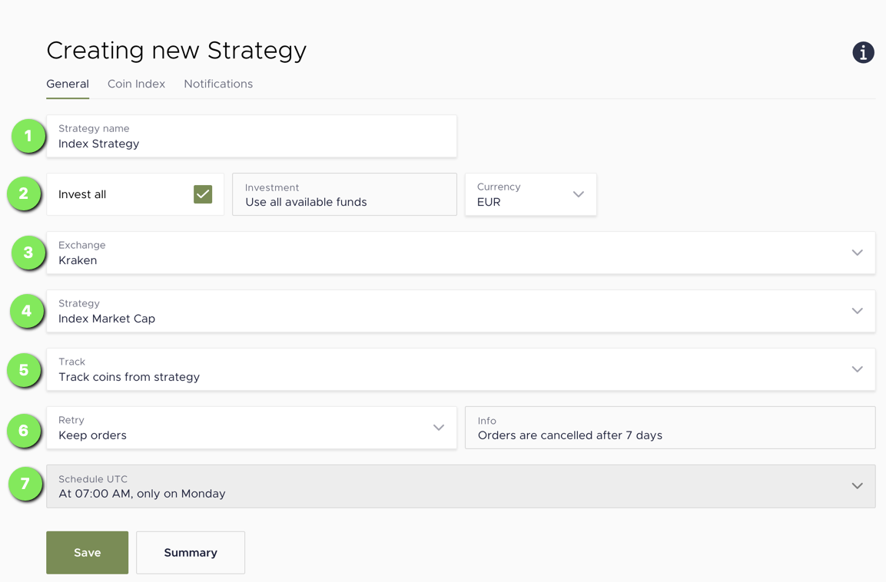

# Strategy

## Create your own Strategy

      
Screenshot

### 1. Name your strategy
Simply name your strategy. The strategy name is used your strategy within the KRYPTIX app and notifications.

### 2. Investment Amount
Choose the amount you want to invest each time the strategy is executed.
If you check invest all, all aviable funds on the account will be invested.

### 3. Choose your crypto-exchange
Select the exchange you want to use for your strategy. The orders generated by the strategy are sent to the selected exchange. Each exchange has different coins available and minimum orders required, which has an influence on the strategy execution.

You can check how to set up an exchange on KRYPTIX [here](exhange.md).

### 4. Strategy

The strategy defines how KRYPTIX calculates your target coin distribution. Currently their are two aviable strategys

##### Index Market Capitalization

With the Index Market Cap strategy the distribution of coins is calculated by the market capitalization of each coin. In the Coin Index tab you can weight, ban or fix the percentage of relevant coins.

The data for the market capitalization is updated in real time before an strategy is excuted.

##### Fixed Percentage
With this strategy you can define a static distribution of coins you want to invest into.

- Choose your coins
- Activate your strategy

- Example Strategy Market indix
- Example Strategy Small coins
