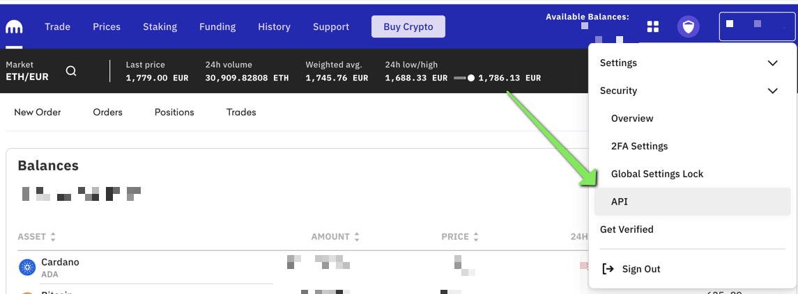
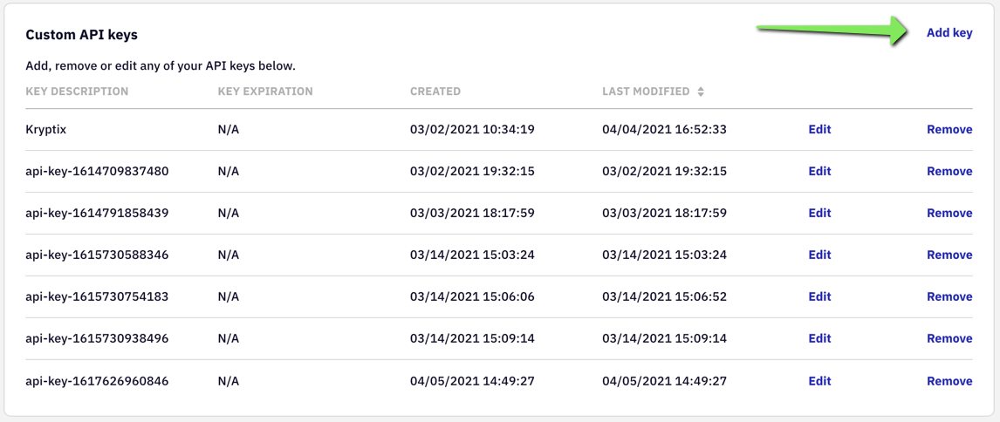
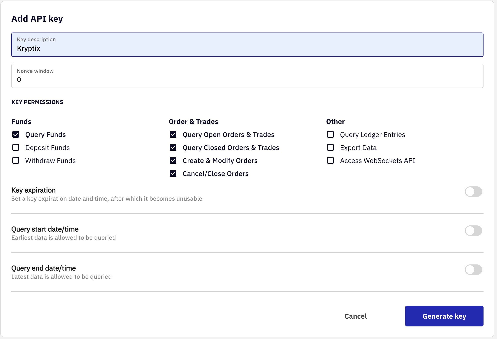
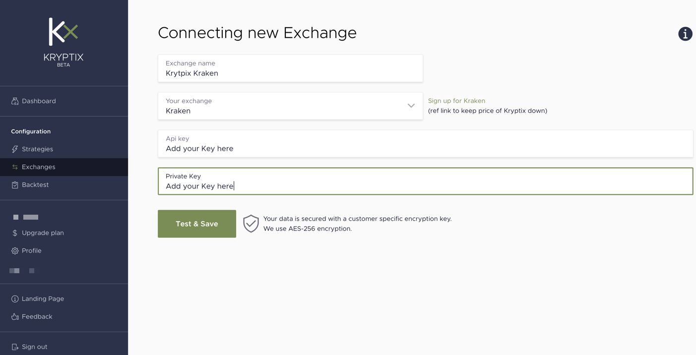
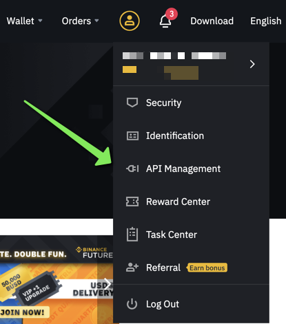
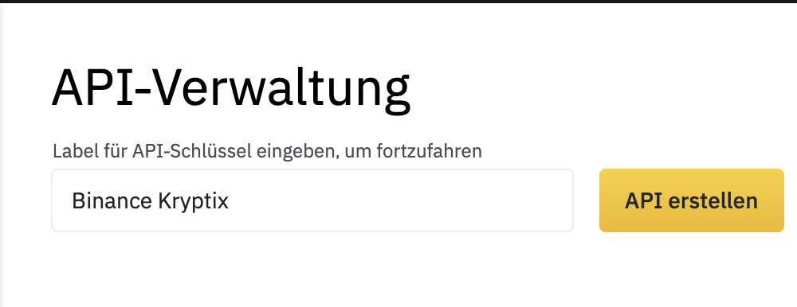
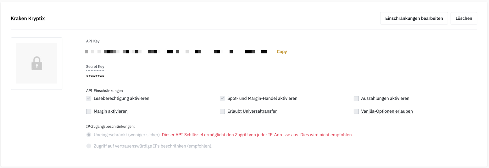

# Crypto-Exchange
## How to connect your Crypto-Exchange to Kryptix
### Kraken Setup

      
Sign into Kraken.

[Sign in](Kraken.com) into Kraken. Dont have an account? [Sign up](https://www.kraken.com/sign-up?clickid=xvV1ixUJExyLTZIwUx0Mo3EoUkESwB0MNUQt2M0&utm_source=Impact&utm_medium=Affiliate&utm_campaign=2673014&utm_content=%22Create%20an%20account%20with%20Kraken%22&irgwc=1&mpid=2673014) here and support Kryptix.

      
Navigate to the API Settings

      
Add a new API Key

      

      
Configure API Settings

      
Copy the key to Kryptix

Find out more information about the API Key on the offical [Kraken Website](https://support.kraken.com/hc/en-us/articles/360000919966-How-to-generate-an-API-key-pair-).

### Binance Setup

      
Sign into Binance.

[Sign in](Binance.com) into Binance. Dont have an account? [Sign up](https://accounts.binance.com/en/register?ref=82078248&utm_campaign=web_share_copy) here and support Kryptix.

      
Navigate to the API Settings

      
Add a new API Key

      

      
Configure API Settings

      
Copy the key to Kryptix

Find out more information about the API Key on the offical [Binance Website](https://www.binance.com/en-NG/support/faq/360002502072).
